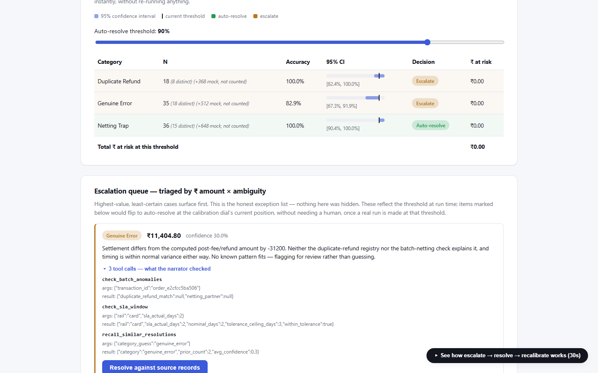

# Settlement Reconciliation Copilot

Razorpay AI Buildathon 2026, Track 04.

## Who this is for

A merchant's finance analyst on the Tuesday after a settlement cycle. They have a Razorpay settlement
report, a bank statement, and their own ERP ledger, and the three do not agree. Their day goes on
deciding which mismatches are explained, which need a human, and which are money someone owes them.

This system does that triage. It closes 98.9% of a realistic 97%-clean batch deterministically (85.0%
at the demo's denser default), escalates the rest with the evidence attached, and refuses to
auto-resolve any category it has not measured itself accurate on. Today that means it refuses all of
them, which is the next section. It also audits the fee against the
merchant's contract, because a wrongly-charged fee reconciles perfectly.

Live: [razorpay-buildathon-five.vercel.app](https://razorpay-buildathon-five.vercel.app)

## The gate says no

Nothing in this system currently has autonomy, and that is the result rather than a gap in it.

The trust gate recomputed a Wilson lower bound after every batch and granted autonomy the first time
it cleared 90%. Wilson's coverage holds at a fixed n; re-checking and stopping at the first crossing
is optional stopping, and the guarantee does not survive it. Tested against what the bound actually
promises, P(bound > true accuracy) at most 5%, it came out at 9.72%, 10.12% and 8.77% across true
accuracies of 88%, 90% and 92%. About twice its stated level, in the direction that hands out
autonomy nothing earned.

The gate now uses a confidence sequence, valid at every stopping time by construction. Under it
`netting_trap` scores 88.4% and `duplicate_refund` 85.6% against a 90% bar, and both escalate. Forty
perfect decisions were worth 91.2% under the old bound and are worth 86.6% under this one.

A payments company should want a gate that refuses on 37 samples. The mechanism, the measurement, and
the fact that the corrected version says no are the contribution; a gate that has never refused has
never been tested. What the system can safely automate today is 59.3% of decisions at a 1.0% error
rate, at a threshold it is honest about rather than one it cleared by being asked repeatedly.

## Where AI belongs

Every category I built for the model to handle fell to a rule I wrote afterwards. `netting_trap` to a
20-line check. `multiway_netting_trap` to a hash table. `narration_explained` to a keyword scan. Three
times is not bad luck. Settlement records come from deterministic processes, so their ground truth is
arithmetically derivable, and a rule always wins.

So I inverted the pipeline. The deterministic resolver runs first and keeps everything it can explain
alone. The model sees only what is left: two or more equally valid explanations, or none. A case a
rule could solve is taken by the rule, so it never sits inside a model's accuracy figure. With k valid
explanations, blind choice scores exactly 1/k, which makes the baseline computed.

The economics follow from the same fact. Chains and matching run at 20,513 tx/sec. A real model runs
at 2.58 tx/sec, about 8,000 times slower. At 100,000 transactions a day, 98,880 resolve
deterministically in about 5 seconds and the 1,120 reaching a model take 7 minutes. Running everything
through the model would take 10.8 hours.


*A real escalated case, with the tool calls and results behind it.*

## Reading bank remittance advice

I wrote the strongest rule I could: fragment splitting, cause keywords, and a 29-entry negation-cue
list assembled with full sight of the generator's phrasing. Both readers were then tested on held-out
phrasing, with the domain vocabulary intact so the rule could not fail on a missing synonym.

| Reader | Phrasing its author saw | Held-out phrasing |
|---|---|---|
| best rule I could write | 95.2% [92.8, 96.9] | 61.7% [56.9, 66.2] |
| `qwen2.5:7b-instruct` | 79.8% [75.7, 83.3] | 72.6% [68.2, 76.7] |
| `qwen2.5:14b-instruct` | 86.9% [83.3, 89.8] | 81.7% [77.7, 85.1] |
| `openai/gpt-oss-20b` | 92.1% [89.2, 94.4] | 96.2% [93.9, 97.6] |

420 judgements per cell, and the intervals do not overlap on held-out phrasing. Most of the rule's
advantage was authorship, not reading. Two model families, so the finding is not about qwen.

The accuracy gap understates it. On unfamiliar phrasing the rule reads a denial as a confirmation in
**38.3%** of judgements, asserting charges the text says were not applied. The models sit between 0.2%
and 3.6%, and their dominant error runs the other way: they miss the mention, so the case escalates.
Wrong, but safe.

## Where that pays, and where it does not

On the compound residual, a free heuristic that ignores the advice scores 31.7% against the 14b
reader's 26.7%, and the paired test gives p = 0.55. Reading did not help where it competes with a
structural prior.

On three-source matching every structured field is exhausted by construction, leaving only the
free-text settlement cycle. On held-out phrasing the regex scores 88.0%, identical to not parsing at
all, and the local model scores 94.0% (exact McNemar p = 0.049). Re-weighting the structured fields by
log-odds estimated from data rather than by constants I chose lifts that baseline to 91.3%, so the
model's margin is 2.7 points and not 6.

The settlement Q&A agent splits the same way. Across nine questions with ground truth computed from
the batch, a keyword router scores 87.5% on my phrasing and **0.0%** on held-out phrasing; the model
goes 65.0% to 62.5%, and neither fabricated a transaction id.

Free text as one signal among several does not pay for itself. As the only evidence left it is worth
6 points, and the rule is worth zero.

## Forecasting

The forecaster declines cases where its own arithmetic does not apply, decided from Order, Payment and
Refund alone and never from a settlement that does not exist yet.

| Scored population | n | exact | median err | mean err |
|---|---|---|---|---|
| what it forecasts | 1,795 | **80.8%** | 0.00% | 3.18% |
| what it refuses | 205 | 0.0% | 77.85% | 107.22% |
| everything | 2,000 | 72.5% | 0.00% | 13.87% |

Five numbers because the mean sits far from the middle: 83% of it comes from five rows out of 1,795.

Date intervals are fitted on one batch and verified on twelve others. A calibrated 90% interval covers
93.8% of held-out settlements at 2.40 days wide, against the SLA window's 87.2% at 1.14 days. The SLA
window states no confidence level, so no coverage figure can falsify it. The calibrated one can be
checked, and it is conservative at every level from 50% to 99%.

## Money the merchant is already losing

Reconciliation compares the settlement against the records. It never compares the fee against the
merchant's contract, so a fee charged at the wrong rate reconciles cleanly forever. Neither Razorpay
Recon nor Settlement Insights performs that check.

Three patterns ship: a card-grade rate applied to UPI, GST computed on the gross amount instead of the
fee, and a wrong GST slab. False positive rate is **0 across 51,000** ordinary transactions, in 0.06s,
which is what makes it safe to run unattended. GST on the gateway fee is Input Tax Credit, normally
buried in one "gateway charges" ledger line; the ERP export splits it onto its own line.

Full numbers with reproduce commands: [RESULTS.md](docs/RESULTS.md).

## Verify it yourself

```bash
cd backend && python -m pytest tests/ -v                 # 494 tests — needs nothing but Python
python scripts/generate_reading_evidence.py              # the table above  (needs Ollama)
python scripts/generate_three_source_evidence.py         # the McNemar result (needs Ollama)
```

## What this can't do

I wrote both phrase banks, so the held-out phrasing is held out from the parser and not from me.
Cascade routing is built, measured at 20.0%, and does not work. Three-source matching runs from its
own script rather than the shipped batch loop. Settlement is structurally unavailable in Razorpay's
test mode, so four of five causal-chain hops are real API objects and the fifth is synthetic.

Full list: [LIMITATIONS.md](docs/LIMITATIONS.md).

## What broke

A hosted-model column once scored byte-identical to its baseline in both conditions. A missing API key
was raising on every call, the retry wrapper saw no rate-limit string, and it returned "no reading
available". Three hundred silent failures look exactly like a model that reads nothing, and I was one
edit from publishing "gpt-oss-20b buys nothing" as a fact about the model. The tell was the
three-decimal match.

Thirteen incidents with sourced attribution: [WHAT_BROKE.md](docs/WHAT_BROKE.md).

## Get it running

```bash
git clone https://github.com/tfthushaar/razorpay_buildathon.git && cd razorpay_buildathon
cd backend && python -m venv .venv
source .venv/bin/activate          # Windows: .venv\Scripts\activate
pip install -r requirements.txt
python -m uvicorn app.main:app --port 8000    # then: cd ../frontend && npm install && npm run dev
```

Full setup, providers, deployment: [SETUP.md](docs/SETUP.md).

## Further reading

[Architecture](docs/ARCHITECTURE.md) · [Results](docs/RESULTS.md) · [Credit](docs/CREDITS.md) ·
[Superseded experiments](docs/RESULTS_SUPERSEDED.md) · [What broke](docs/WHAT_BROKE.md) ·
[Limitations](docs/LIMITATIONS.md) · [Positioning](docs/positioning.md) ·
[Screenshots](docs/screenshots.md) · [Evidence](docs/evidence/) · [Build log](BUILD_LOG.md)
