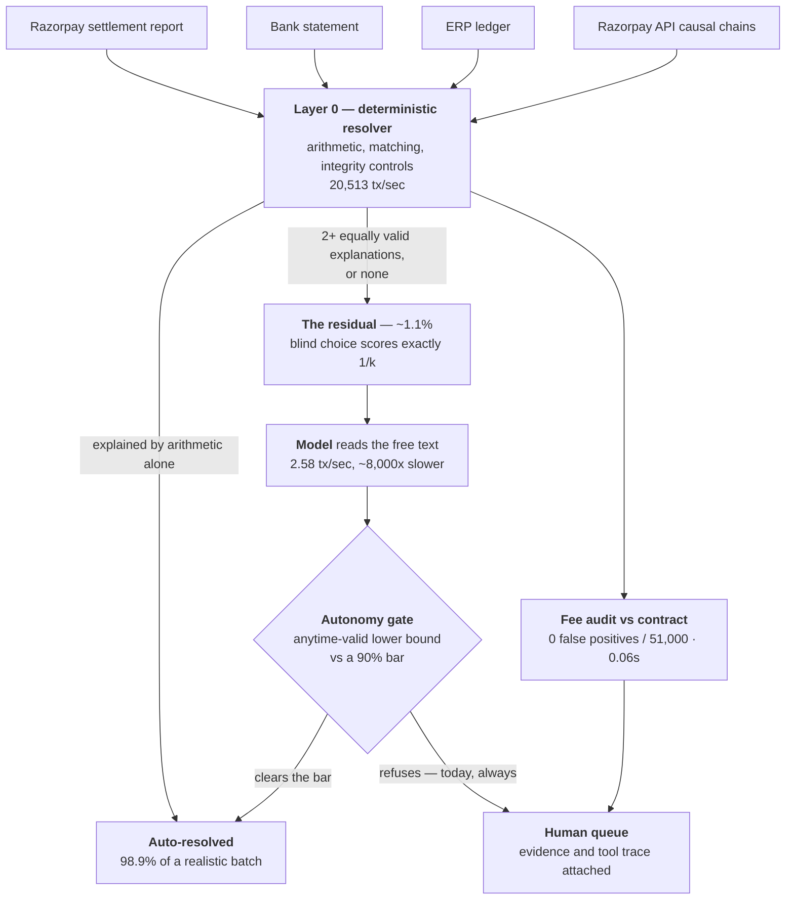

# Architecture



The shape is the argument. A case a rule can close is closed by the rule, so it never enters a model's
accuracy figure, and the model is measured only on cases where the deterministic layer genuinely could
not decide. That makes the baseline computed rather than assumed: with k valid explanations remaining,
blind choice scores exactly 1/k.

## The inversion

Every category I built for the model to handle fell to a rule I wrote afterwards. Settlement records
come from deterministic processes, so their ground truth is arithmetically derivable. For any
classification task posed over them, a rule exists that wins. A fourth category would have reproduced
the pattern a fourth time. So the pipeline is inverted.

```
Layer 0   DETERMINISTIC RESOLVER. Runs first, keeps everything it can explain alone.
          Candidate pool: contracted and plausible fee rates, real refunds on the payment,
          standard TDS/reserve/GST rates, FX rounding, batch netting partners, a
          narration-asserted waiver. Then an exhaustive search for every subset that
          accounts for the observed delta.                          app/resolver/

Layer 1   THE RESIDUAL, of exactly two kinds.
            UNDER_DETERMINED   2 or more valid explanations, no basis to choose
            UNMATCHED          none found

Layer 2   THE MODEL works only on Layer 1. It never sees a case Layer 0 resolved.
                                                        app/narrator/attribution.py

Layer 3   VERIFIER and PER-CAUSE CALIBRATION score what comes back.
                        app/resolver/verifier.py, app/calibration/cause_calibrator.py
```

Two consequences follow.

A case a rule could solve is taken by the rule, so it cannot sit inside a model's accuracy figure.
The exclusion is structural, and nothing about it depends on my discipline. It is also tested rather
than asserted: `tests/test_residual_boundary.py` spies on what the narrator is shown and fails if it
intersects what Layer 0 closed, if the residual stops being a minority (15.0% at demo density, 1.1%
at realistic), or if turning the model off moves a single deterministic answer.

The baseline is computed. With k valid explanations and no basis to prefer any,
blind choice scores exactly 1/k. `UNDER_DETERMINED` is the load-bearing half, because it cannot be
answered with "your resolver isn't good enough yet". A stronger resolver finds more valid
decompositions, never fewer.

Nothing earlier was discarded. `check_batch_anomalies`, the k-sum solvers, the fee recomputation and
the narration read all became candidate generators inside Layer 0. They were never the wrong code.
They were in the wrong position.

## What the model is asked for

A decomposition: which causes, in what amounts, citing what evidence. A label is what a lookup table
produces, and it gives a verifier nothing to check. Two deterministic checks apply
(`app/resolver/verifier.py`):

- Arithmetic. The components must sum to the observed delta within tolerance.
- Grounding. Every `evidence_ref` must resolve to a real object whose properties support the amount
  claimed. Citing a real refund on a different payment fails. Citing a real refund for the wrong
  amount fails.

A failed check returns the specific complaint for another attempt. Confidence stops being a number
the model asserts about itself and becomes how many verification rounds the answer survived.

Calibration moves to per-cause, so one cause can lose autonomy without dragging four unrelated ones
down. Each decomposition also yields several judgements per transaction, which raises n faster: 10/10
has a Wilson lower bound of 72.2%.

## Where each category is resolved

| Category | Resolved by | Verified by |
|---|---|---|
| `clean_match`, `timing_lag`, `fee_deduction`, `partial_refund`, `currency_rounding` | Pass 1/2 matching engine, no LLM | arithmetic fact, so no statistical estimate is needed |
| `duplicate_refund`, `netting_trap` | rule and model both score 100% | Wilson lower bound over accumulated real decisions |
| `genuine_error` | model, never auto-resolves by design | escalation is the correct resolution |
| `multiway_netting_trap` | model only; `check_batch_anomalies` checks pairs, never combinations | `verify_group_sum` re-adds the numbers |
| `narration_explained` | model only; the fact exists solely in free text | no structured field to check against |
| `compound_delta` | Layer 0 enumerates, model chooses | sum plus citation grounding |

The first two rows are why the LLM's value on those categories is reliability under failure (API
errors, malformed tool arguments, hallucinated ids) rather than judgment. A 20-line rule matches it
exactly across 519 cases.

## Three-source matching

Everything above reconciles gateway data against itself, so the join is trivial by construction and
all difficulty sits in the arithmetic. Real reconciliation is three systems that never agreed: the
settlement report, the bank statement, and the merchant's ERP ledger
(`app/data_gen/three_source.py`). Banks truncate the UTR, prefix it with a scheme code, render the
merchant name in their own house style, and slip the value date across a weekend.

`app/resolver/entity_resolution.py` is Layer 0 for that problem, emitting the same three statuses and
the same 1/k baseline. It also checks the residual argument itself: if under-determination only
appeared in compound arithmetic, it would be fair to suspect the arithmetic was built to produce it.

The hard case is the one every subscription business produces constantly: two payouts, same merchant,
same amount, same day. Every structured field stops discriminating at once. Only the free-text
settlement cycle remains. Numbers: [RESULTS.md](RESULTS.md).

## Data model and pipeline

Every transaction is a causal chain: `order → payment → fee → tax → refund(s) → settlement`. A
mismatch is located at the hop that diverges (`app/chain/builder.py`) instead of surfacing as a row
that failed to match. Field names mirror Razorpay's real API shapes (`entity` tag, `utr` on Settlement,
`fee`/`tax`/`captured` on Payment). Amounts are in paise throughout.

```
generate → build_chains → matching engine (Pass 1/2) → [resolver → model] → calibration
         → audit log → escalation queue → dashboard
```

Ground truth is threaded through for scoring only. It never reaches the matching engine, the resolver
or the narrator, verified by scanning those module sources for any ground-truth reference.

## Forecasting

`app/forecast/predictor.py` predicts net amount and settlement date from an Order and a Payment,
before any Settlement exists. It reuses the fee and SLA constants the rest of the project already
tests against, so the prediction and the reconciliation agree on the merchant's contract by
construction.

Two layers sit around it, and both exist to keep the output falsifiable.

`forecastability.py` decides what to decline. `predict_settlement` computes net as
`captured - fee - tax`, which is exact for an ordinary transaction and wrong for five identifiable
shapes: a partial capture, a refund in flight, an uncaptured payment, a non-positive net, and an SLA
ceiling already past. Each is decidable from Order, Payment and Refund alone. None consults a
Settlement, which would make the forecast a lookup. `generate_pending_batch(edge_case_ratio=...)`
produces the four shapes the settled batch never contains, so every reason is exercised against
generated data rather than a hand-built object; it defaults to off.

`calibrated_interval.py` decides how wide the date window should be. The default window is the rail's
SLA tolerance, a policy boundary that states no confidence level and therefore cannot be checked
against one. Passing a fitted model instead gives an empirical quantile of that rail's observed lag
at a stated confidence, and `reliability_curve()` scores nominal against empirical coverage on
batches the model was never fitted on. `predict_settlement` reports which source produced its
interval and what level it claims, so a caller never has to infer it.

Amount error is reported as five numbers (`backtest.ape_panel`): exact rate, median, mean, p95 and
worst. A single mean was misleading on this data, where 83% of it came from five rows out of 1,795.

## The Q&A agent

`app/qa/` answers free-text questions over a completed batch through a tool loop. Four tools are
scoped to one transaction, one date or the anomaly check. Two more cover what a controller asks
first: `summarise_batch` for batch size, settled value, how many reconcile exactly and how many need
review, and `settlements_by_date` for when money actually lands, which groups settlements by day and
names the busiest one. Everything they report comes from chain arithmetic and the deterministic
matching engine, never from the generator's labels.

The mock provider routes the same tools through a keyword list, which makes it a real baseline rather
than a strawman, and a test asserts the held-out question bank contains none of that vocabulary. It
gets no cue for the date-grouping tool: its date regex already reaches the phrasing its author saw,
and inventing one for "busiest payout day" would hand the baseline a word it never earned.

## Other loops

One more model call proposes a named hypothesis instead of stopping at `genuine_error`
(`app/narrator/discovery.py`). A fee-leak detector compares the charged fee against the merchant's
contract, a check no reconciliation-only pipeline performs (`app/feeleak/`). An ERP journal export
produces Tally XML with GST separated into its own ITC-eligible line (`app/erp/`).

## The Razorpay connector

Four of five causal-chain hops are real API objects: order, captured payment, fee/tax, refund.
Settlement is structurally excluded from test mode on any account, confirmed against Razorpay's own
docs, so the synthetic generator covers that leg alone. `POST /api/webhooks/razorpay`
(`app/webhooks/razorpay.py`) does real HMAC-SHA256 verification over the raw body and real
`settlement.processed` parsing.

## Tech stack

FastAPI, Pydantic and SQLite on the backend. React, TypeScript and Vite on the frontend. Ollama for
the local default (`qwen2.5:7b-instruct`, zero cost, no rate limit), Groq (`openai/gpt-oss-20b`) as
the hosted path. No ORM, no message queue, no Docker requirement.

Experiments that led to the inversion, measuring an architecture no longer used:
[RESULTS_SUPERSEDED.md](RESULTS_SUPERSEDED.md).
