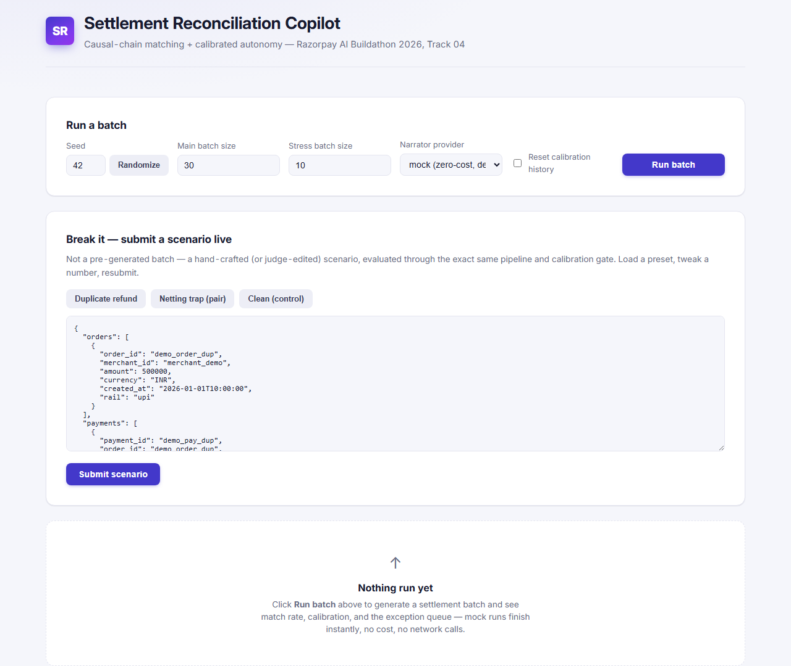
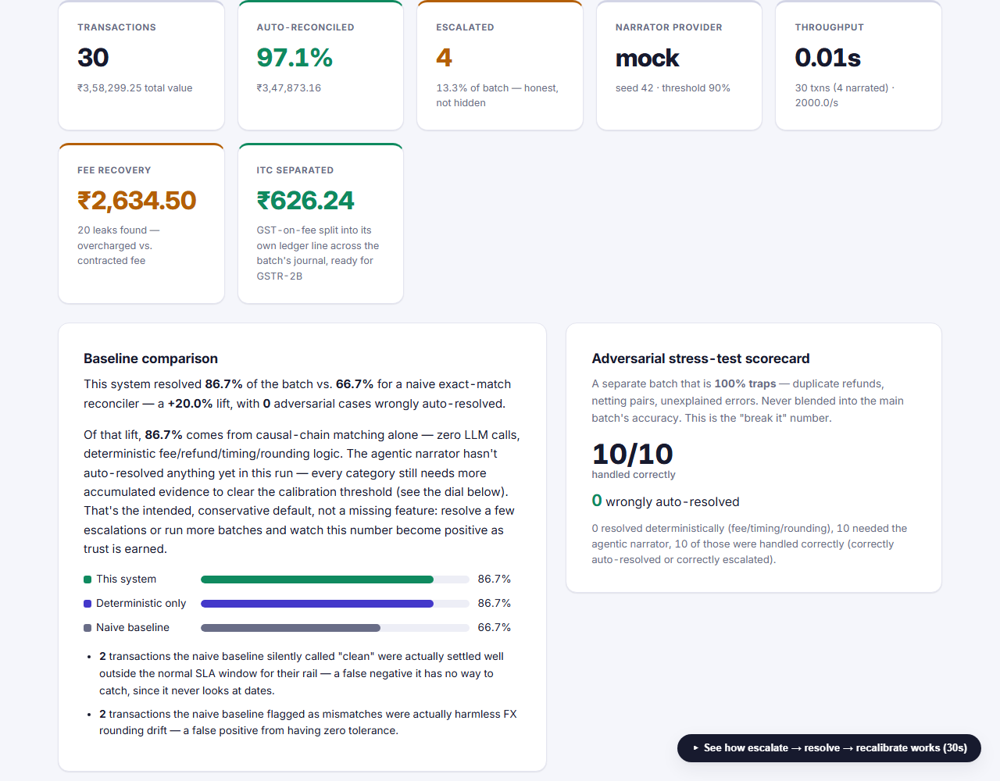
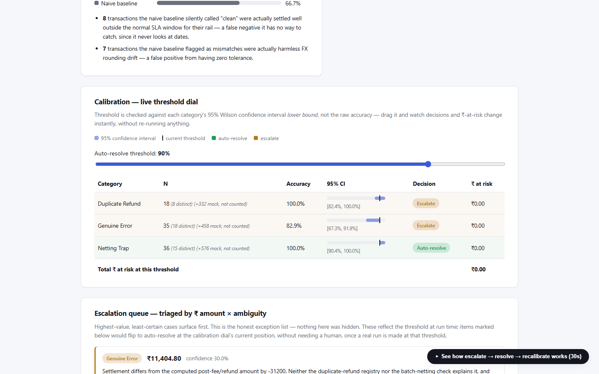
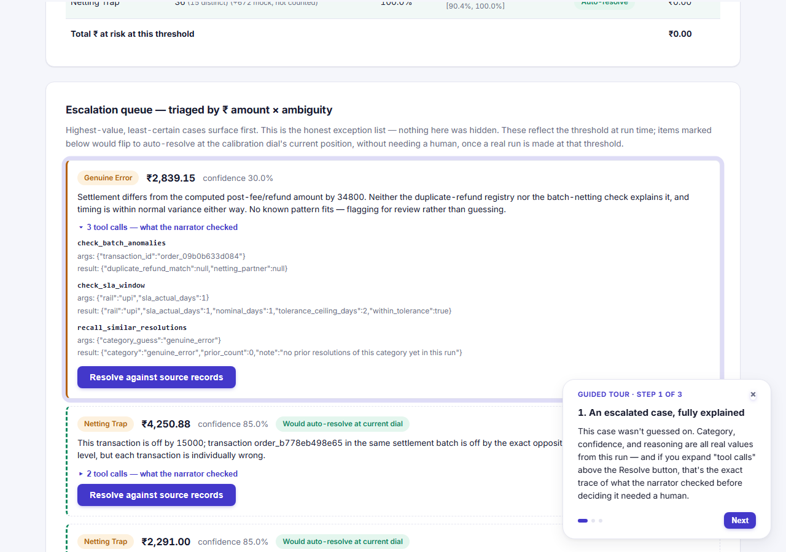
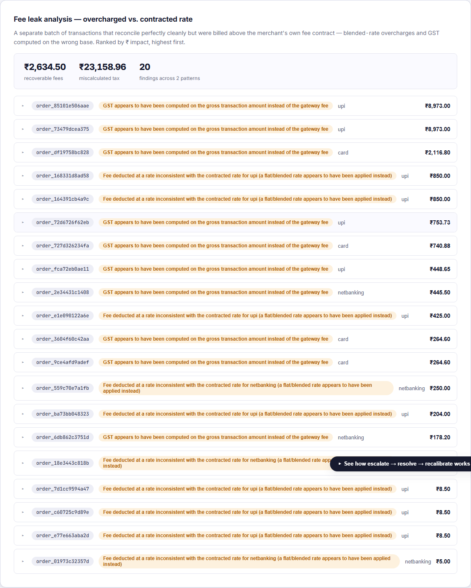
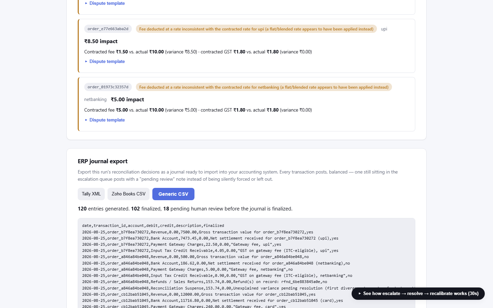

# Screenshot gallery

Captured live in a real browser (Playwright, headless Chromium), against a mock-provider run — zero
console/network errors, nothing staged. The [README](../README.md) leads with the escalation
tool-trace screenshot alone, since it's the one image that proves "agentic" and "auditable" at once;
the rest of the run is below.

**Before a run — nothing hidden behind a login or a loading spinner:**

**After running a batch — match rate, ₹ auto-reconciled, and the naive-baseline lift, all real
numbers from that run:**

**The calibration dial — drag it and every category's auto-resolve/escalate decision and ₹-at-risk
recompute instantly, no re-run:**

**The guided tour, walking through escalate → resolve → recalibrate:**

**Fee leak analysis — ranked by ₹ impact, each finding expandable to a ready-to-send dispute
template:**

**ERP journal export — real balanced double-entry lines, Tally/Zoho/generic formats, a live preview
before download:**

